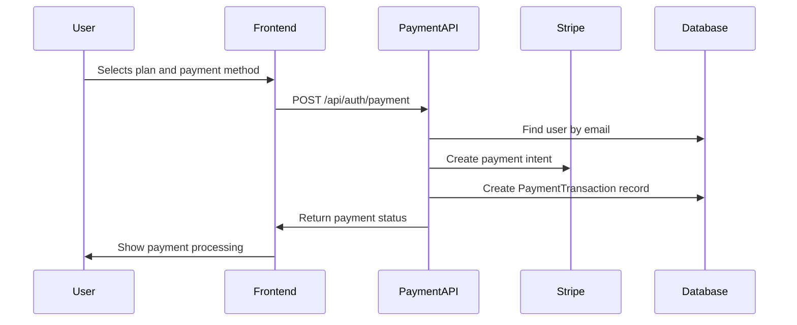
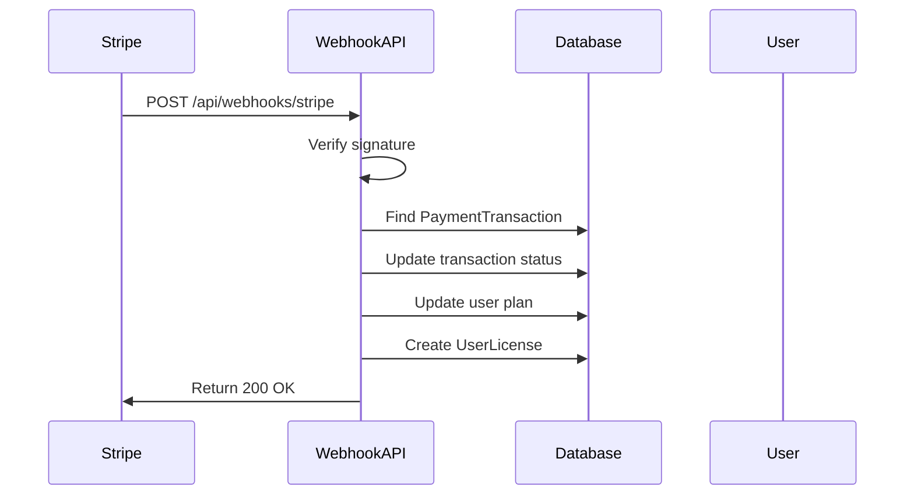
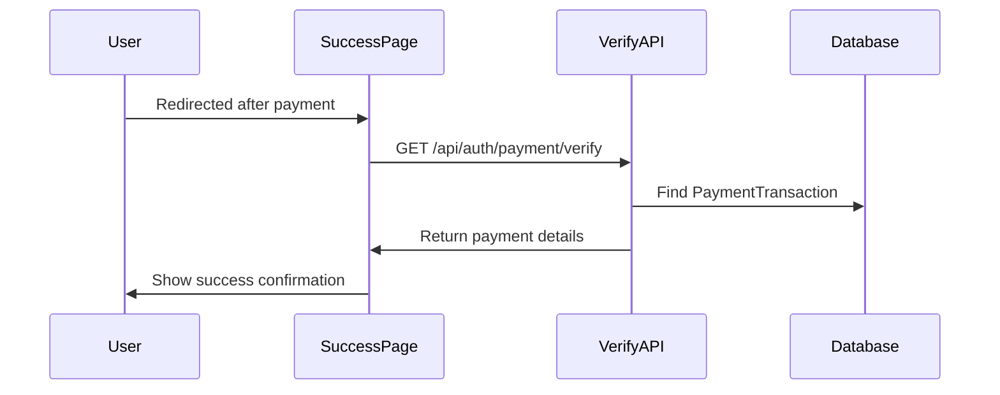

# Stripe Webhook Implementation Guide

## Overview

This implementation provides a complete webhook system for handling Stripe payment events in your Next.js application. The system ensures secure payment processing, proper user subscription management, and comprehensive payment tracking.

## Architecture

### 1. Database Models

#### PaymentTransaction Model
- **Purpose**: Tracks all payment transactions and their status
- **Key Fields**:
  - `stripePaymentIntentId`: Unique Stripe payment intent identifier
  - `userId`: Reference to the user who made the payment
  - `planId` & `planName`: Subscription plan details
  - `amount` & `currency`: Payment amount and currency
  - `status`: Payment status (pending, succeeded, failed, canceled, requires_action)
  - `webhookProcessed`: Boolean flag to prevent duplicate processing
  - `billingDetails`: JSON field storing billing information
  - `metadata`: Additional Stripe metadata

#### User Model Updates
- **Plan Field**: Updated to reflect current subscription plan
- **Association**: One-to-many relationship with PaymentTransaction

#### UserLicense Model
- **Purpose**: Manages user subscription licenses
- **Key Fields**:
  - `licenseType`: Type of license (plan name)
  - `startDate` & `endDate`: License validity period
  - `isActive`: License status
  - `price` & `currency`: License cost

### 2. API Endpoints

#### Payment Processing (`/api/auth/payment`)
- **Method**: POST
- **Purpose**: Creates payment intents and initial transaction records
- **Flow**:
  1. Validates payment method and plan
  2. Creates Stripe payment intent
  3. Creates initial PaymentTransaction record
  4. Returns payment status to frontend

#### Webhook Handler (`/api/webhooks/stripe`)
- **Method**: POST
- **Purpose**: Processes Stripe webhook events
- **Security**: Signature verification using webhook secret
- **Events Handled**:
  - `payment_intent.succeeded`: Updates user plan and creates license
  - `payment_intent.payment_failed`: Marks transaction as failed
  - `payment_intent.canceled`: Marks transaction as canceled
  - `payment_intent.requires_action`: Handles 3D Secure authentication

#### Payment Verification (`/api/auth/payment/verify`)
- **Method**: GET
- **Purpose**: Verifies payment status for success page
- **Parameters**: `payment_intent` (Stripe payment intent ID)

### 3. Frontend Components

#### PaymentRightSideContent
- **Purpose**: Main payment form component
- **Features**:
  - Stripe Elements integration
  - Billing information collection
  - Payment method selection
  - Real-time payment processing

#### Payment Success Page (`/payment/success`)
- **Purpose**: Displays payment confirmation
- **Features**:
  - Payment verification
  - User plan update confirmation
  - Navigation to dashboard

## How It Works

### 1. Payment Initiation Flow



### 2. Webhook Processing Flow



### 3. Payment Success Flow



## Security Features

### 1. Webhook Signature Verification
- Uses Stripe webhook secret for signature validation
- Prevents unauthorized webhook calls
- Ensures data integrity

### 2. Idempotency
- `webhookProcessed` flag prevents duplicate processing
- Database constraints prevent duplicate payment records
- Stripe payment intent IDs are unique

### 3. Error Handling
- Comprehensive error logging
- Graceful failure handling
- User-friendly error messages

## Environment Variables Required

```env
# Stripe Configuration
STRIPE_SECRET_KEY=sk_test_...
NEXT_PUBLIC_STRIPE_PUBLISHABLE_KEY=pk_test_...
STRIPE_WEBHOOK_SECRET=whsec_...

# Application Configuration
NEXT_PUBLIC_BASE_URL=http://localhost:3000
```

## Stripe Dashboard Configuration

### 1. Webhook Endpoint Setup
1. Go to Stripe Dashboard > Webhooks
2. Add endpoint: `https://yourdomain.com/api/webhooks/stripe`
3. Select events:
   - `payment_intent.succeeded`
   - `payment_intent.payment_failed`
   - `payment_intent.canceled`
   - `payment_intent.requires_action`
4. Copy webhook secret to environment variables

### 2. Test Mode Configuration
- Use test API keys for development
- Test with Stripe test cards
- Monitor webhook delivery in Stripe Dashboard

## Database Migration

The system requires the following database tables:

```sql
-- Payment transactions table
CREATE TABLE payment_transactions (
  id SERIAL PRIMARY KEY,
  user_id INTEGER NOT NULL REFERENCES users(id),
  stripe_payment_intent_id VARCHAR(255) UNIQUE NOT NULL,
  stripe_customer_id VARCHAR(255),
  plan_id VARCHAR(100) NOT NULL,
  plan_name VARCHAR(255) NOT NULL,
  amount DECIMAL(10,2) NOT NULL,
  currency VARCHAR(10) NOT NULL,
  status VARCHAR(50) NOT NULL DEFAULT 'pending',
  payment_method VARCHAR(255),
  customer_email VARCHAR(255) NOT NULL,
  billing_details JSON,
  metadata JSON,
  webhook_processed BOOLEAN DEFAULT FALSE,
  webhook_processed_at TIMESTAMP,
  failure_reason TEXT,
  created_at TIMESTAMP DEFAULT NOW(),
  updated_at TIMESTAMP DEFAULT NOW()
);

-- Indexes for performance
CREATE INDEX idx_payment_transactions_user_id ON payment_transactions(user_id);
CREATE INDEX idx_payment_transactions_status ON payment_transactions(status);
CREATE INDEX idx_payment_transactions_created_at ON payment_transactions(created_at);
```

## Testing

### 1. Test Cards
Use Stripe test cards for testing:
- Success: `4242424242424242`
- Requires 3D Secure: `4000002500003155`
- Declined: `4000000000000002`

### 2. Webhook Testing
- Use Stripe CLI for local webhook testing
- Monitor webhook delivery in Stripe Dashboard
- Check database for proper record creation

### 3. Error Scenarios
Test various failure scenarios:
- Invalid payment methods
- Declined cards
- Network failures
- Webhook processing errors

## Monitoring and Logging

### 1. Application Logs
- Payment processing logs
- Webhook event logs
- Error tracking
- Performance metrics

### 2. Database Monitoring
- Payment transaction status
- User plan updates
- License creation
- Failed payment tracking

### 3. Stripe Dashboard
- Payment success rates
- Webhook delivery status
- Error rates
- Revenue tracking

## Troubleshooting

### Common Issues

1. **Webhook Not Receiving Events**
   - Check webhook endpoint URL
   - Verify webhook secret
   - Check Stripe Dashboard for delivery status

2. **Payment Not Updating User Plan**
   - Check webhook processing logs
   - Verify user exists in database
   - Check payment transaction status

3. **Duplicate Processing**
   - Verify `webhookProcessed` flag logic
   - Check for duplicate webhook deliveries
   - Review idempotency implementation

### Debug Steps

1. Check Stripe Dashboard for payment status
2. Review application logs for errors
3. Verify database records
4. Test webhook endpoint manually
5. Check environment variables

## Best Practices

1. **Always verify webhook signatures**
2. **Implement proper error handling**
3. **Use idempotency keys**
4. **Log all webhook events**
5. **Test thoroughly in staging**
6. **Monitor webhook delivery**
7. **Handle edge cases gracefully**
8. **Keep webhook processing fast**

## Future Enhancements

1. **Email Notifications**: Send confirmation emails
2. **Subscription Management**: Handle recurring payments
3. **Refund Processing**: Handle refund webhooks
4. **Analytics**: Payment analytics dashboard
5. **Multi-currency**: Enhanced currency support
6. **Tax Calculation**: Automatic tax computation
7. **Invoice Generation**: PDF invoice creation
8. **Customer Portal**: Self-service subscription management
